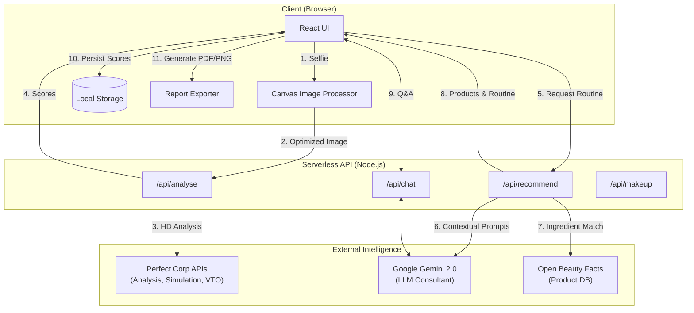
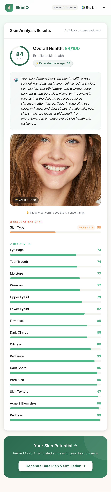
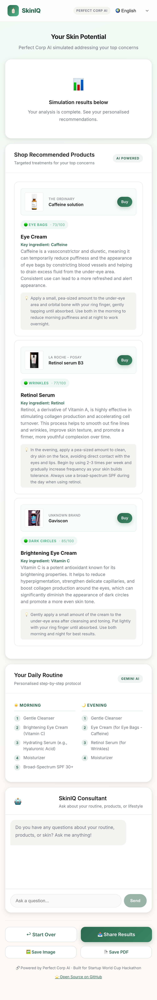
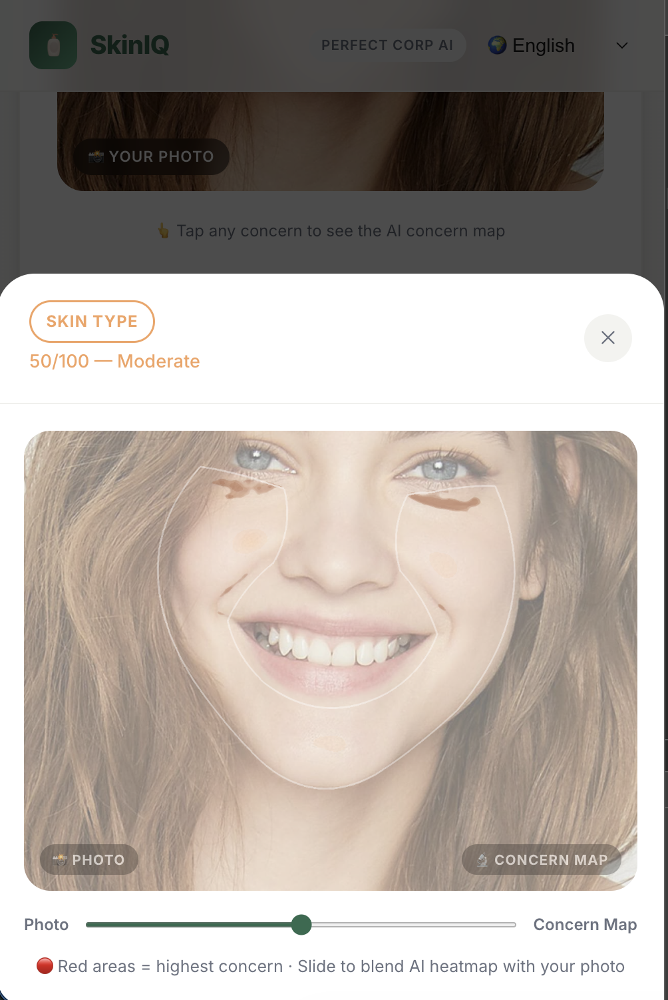
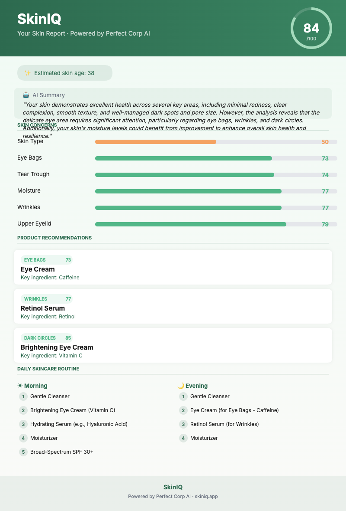

# SkinIQ — Personalised Skin Intelligence + Commerce

[](https://choosealicense.com/licenses/mit/)
[](https://yce.perfectcorp.com)
[](https://aistudio.google.com)
[](https://vercel.com)

> **[🚀 LIVE DEMO](https://skiniq-tau.vercel.app/)** · **[📺 DEMO VIDEO](https://github.com/manojmallick/skiniq)**

**Your skin. Analysed. Healed. Shopped. Consulted.**

Upload a selfie → get a clinical-grade analysis of 14 skin concerns → see what your skin could look like after treatment → get personalised product recommendations → chat with an AI dermatologist for follow-up advice. **Free. 30 seconds.**

Powered by [Perfect Corp YouCam AI](https://yce.perfectcorp.com) · Built for the Perfect Corp × Startup World Cup Hackathon 2026.

---

## 🎯 What It Does

| Step | What Happens |
|------|-------------|
| 📸 **Upload** | User uploads a selfie (drag-and-drop or browse · JPG, PNG, HEIC, WebP). Client-side Canvas pipeline auto-upscales to ≥1080px if needed. |
| 🔬 **Analyse** | Perfect Corp HD Skin Analysis API scores 14 concerns (acne, wrinkles, spots, oiliness, eye bags…) with a heatmap overlay per concern. |
| ✨ **Simulate** | Perfect Corp Skin Simulation API generates a healed before/after visual. Drag the interactive slider to compare. |
| 💄 **VTO** | Perfect Corp Makeup VTO API overlays lipstick on the healed result — try before you buy. |
| 🛍️ **Shop** | Gemini 2.0 recommends personalized ingredients matched to exact scores; Open Beauty Facts surfaces real, purchasable products with buy links. |
| 🤖 **Consult** | Context-aware AI chat (Gemini 2.0) answers follow-up questions about routines, alternatives, and lifestyle — skin scores injected into every message. |
| 📄 **Export** | Save a branded PNG report card, print to PDF, or share via Web Share API / clipboard. |

---

## 🧬 APIs Used (5 total)

| API | Purpose |
|-----|---------|
| **Perfect Corp HD Skin Analysis** | 14 skin concerns, clinical-grade scoring, AI concern heatmap overlays — validated on 70,000 medical-grade images |
| **Perfect Corp Skin Simulation** | Before/after healed skin visual generation |
| **Perfect Corp Makeup VTO** | Virtual lipstick try-on on the healed result |
| **Google Gemini 2.0** | Personalized ingredient recommendations, AM/PM routine generation, dynamic i18n re-translation, and AI chat consultation |
| **Open Beauty Facts** | Real product data (brand, image, buy link) matched to recommended ingredients |

---

## 🏗️ Architecture



---

## 📸 Visual Tour

### 1. High-Precision Analysis
Clinical-grade analysis of 14 skin concerns with AI-powered heatmaps.


### 2. Personalised Care Plan
Gemini 2.0 generated routines and product recommendations from Open Beauty Facts.


### 3. AI Concern Mapping
Interactive heatmaps showing exactly where the AI detects skin concerns.


### 4. Branded Report Export
Export your clinical results as a high-quality PDF or Image for professional consultation.


---

## ✨ Feature Highlights

### 🔬 Analysis Screen
- **Overall Skin Health Score** (0–100) and **Estimated Skin Age** from Gemini
- **14 concern score bars** with colour-coded severity (🔴 Needs attention · 🟡 Moderate · 🟢 Healthy)
- **AI Concern Map Overlay Modal** — click any metric to see a heatmap blended over your photo via an interactive slider

### ✨ Simulation Screen
- **Before/After drag slider** — touch-friendly, works on desktop and mobile
- **Makeup VTO button** — overlays Perfect Corp lipstick on the healed result; slider now compares original vs. made-up
- **Product Cards** — real Open Beauty Facts products (image, brand, buy link) per concern, with key ingredient and usage hint
- **Gemini AM/PM Routine** — numbered morning and evening steps personalised to your skin type and top concerns

### 🤖 AI Chat Assistant *(new)*
- Contextual chat panel powered by **Gemini 2.0** — knows your overall score, skin age, top concerns, and daily routine
- Renders responses in **rich Markdown** (tables, bullet lists, bold, inline code) via a zero-dependency custom renderer
- Multilingual — responds in the app's currently selected language

### 🌍 Full Internationalisation
- **5+ languages**: English, French, Dutch, Hindi, and more
- **Dynamic re-translation**: switching language triggers a live Gemini call to re-translate your routine and product hints on the fly

### 📊 Local-First Progress Tracking
- Every analysis is saved to **`localStorage`** — no server, no database
- **Sparkline chart** on the Upload Screen shows score history with ↑ Improving / ↓ Declining / → Stable indicator
- **History Modal** — per-session breakdown of date, overall score, and top 3 concerns

### 📤 Export & Share
| Mode | Implementation |
|------|---------------|
| 🖼️ Save Image | Branded PNG report card drawn with Canvas API (zero dependencies) |
| 📄 Save PDF | Browser print-to-PDF via `window.print()` |
| 📤 Share | Native Web Share API on mobile; clipboard fallback on desktop |

### 🔒 Privacy-First
- **No images stored.** Photos are processed in memory and discarded immediately after the API call.
- History tracking stores only scores — never photos.
- **GDPR, HIPAA, and CCPA compliant** by design (enforced by the Perfect Corp API).

---

## 🚀 Running Locally

### Prerequisites
- Node.js 18+
- YouCam API key (from [yce.perfectcorp.com](https://yce.perfectcorp.com) — redeem code `Pegasus1000` for free credits)
- Gemini API key (from [aistudio.google.com](https://aistudio.google.com))

### Setup

```bash
git clone https://github.com/manojmallick/skiniq.git
cd skiniq

# Install dependencies
npm install

# Configure environment
cp .env.example .env
# Edit .env and add your YOUCAM_API_KEY and GEMINI_API_KEY

# Run (frontend + API server concurrently)
npm run dev
```

Frontend: http://localhost:5173  
API server: http://localhost:3001  
Health check: http://localhost:3001/health

### Deploy to Vercel

```bash
npm install -g vercel
vercel --prod
# Set YOUCAM_API_KEY and GEMINI_API_KEY in Vercel dashboard → Settings → Environment Variables
```

---

## 📁 Project Structure

```
skiniq/
├── api/
│   ├── analyse.js        # POST /api/analyse  — Perfect Corp HD Skin Analysis + Simulation pipeline
│   ├── recommend.js      # POST /api/recommend — Gemini product recommendations + routine
│   ├── makeup.js         # POST /api/makeup   — Perfect Corp Makeup VTO
│   └── chat.js           # POST /api/chat     — Gemini 2.0 context-aware chat
├── src/
│   ├── App.jsx                        # Screen state machine (upload → loading → analysis → simulation)
│   ├── components/
│   │   ├── UploadScreen.jsx           # Photo upload + drag-and-drop + progress sparkline
│   │   ├── AnalysisScreen.jsx         # 14 concern scores + skin age
│   │   ├── ConcernOverlayModal.jsx    # AI heatmap overlay with blend slider
│   │   ├── SimulationScreen.jsx       # Before/after slider + VTO + products + routine
│   │   ├── ChatAssistant.jsx          # AI chat panel with Markdown rendering
│   │   ├── HistoryModal.jsx           # Past sessions modal
│   │   ├── SkinScoreBar.jsx           # Animated concern score bar
│   │   └── LoadingState.jsx           # Two-stage loading (analysis → recommendations)
│   ├── i18n/
│   │   ├── LanguageContext.jsx        # React context for locale
│   │   └── translations.js           # 5+ language strings
│   ├── services/
│   │   └── api.js                    # Frontend API layer + Canvas auto-upscaler
│   ├── utils/
│   │   └── reportExporter.js         # PNG report card (Canvas) + PDF print
│   └── styles/globals.css            # Design system
├── dev-server.js          # Local dev API server (Express)
├── vercel.json            # Deployment config
└── .env.example           # Environment template
```

---

## 🤝 Contributing

See [CONTRIBUTING.md](./CONTRIBUTING.md). Issues and PRs welcome — especially for items in the [roadmap](https://github.com/manojmallick/skiniq/issues).

## 📄 License

MIT — built by [Manoj Mallick](https://github.com/manojmallick), Amsterdam 🇳🇱
